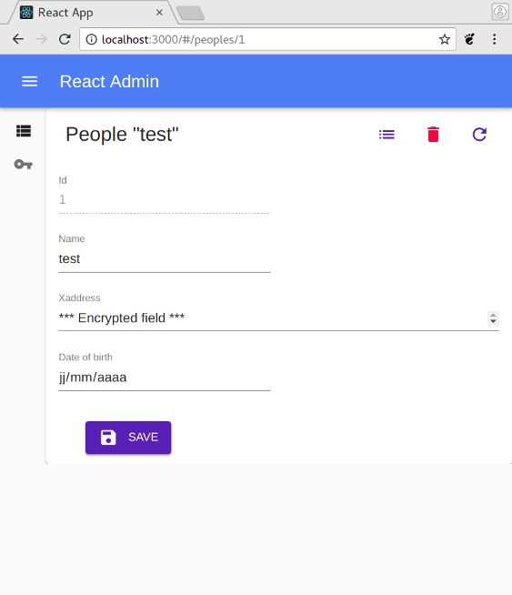
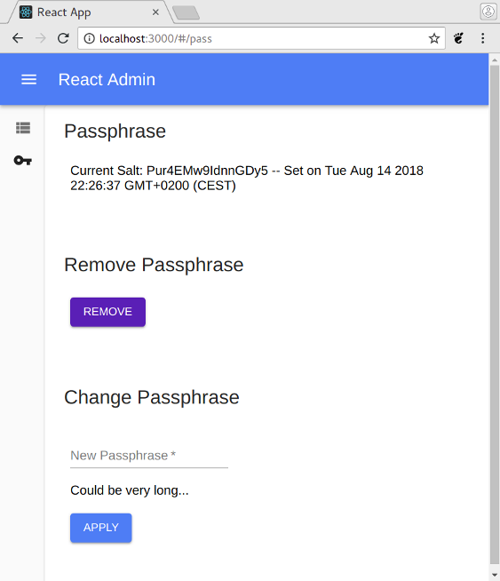

# E2Eencrypt db template

## Description

A template for REST server and [react-admin](https://marmelab.com/react-admin) web application for **end to end encryption** with **shared passphrase** of some db fields.

WIP. Feedback and comments are welcome.


|     |     |
| --- | --- |
|  |  |

## Server

The server is a simple golang REST server, based on [gin-model-template](https://github.com/yvesago/gin-model-template).

gin-model-template allows to quickly write database tables and REST handlers.

For end to end encryption, server maintains a global variable of the passphrase salt and check that each encrypted field start with this salt.

### Config
- ``people.go`` and ``user.go`` are 2 samples tables which can be customized.
- ``repo.go`` contains db parameters
- ``server.go`` contains REST handlers


## Web app Client

**react-admin** allow to quickly write the frontend of the REST server.

Encryption and decryption are released on REST calls. This allows to write usual react-admin forms but encrypted fields are not sortable or searchable.

This template add a form to set or change passphrase. Fields are masked for users without the passphrase.

### Config

- ``AppConfig.js`` allows to set REST API URL.
- ``E2Econfig.js`` allows to describe encrypted fields. 
- ``App.js`` defines _ressources_ like ``peoples.js`` which can be customized.


## Protocol

Passphrase is used to create a **scrypt** key stored in browser local storage.

Fields are encypted with **chacha20poly1305** from [libsodium.js](https://github.com/jedisct1/libsodium.js).

Each encrypted field is stored on server with base64 format and start with scrypt salt to maintain coherence of the shared key.

Read [PROTOCOL.md](./PROTOCOL.md) for details and threat model.


## Start server

```
$ go get github.com/gin-gonic/gin
$ go get github.com/itsjamie/gin-cors
$ go get github.com/mattn/go-sqlite3
$ go get gopkg.in/gorp.v2

$ go run server.go

```
to run tests add :
```
$ go get github.com/stretchr/testify/assert
$ go get golang.org/x/crypto/chacha20poly1305
$ go get golang.org/x/crypto/scrypt

$ go test -v ./models

```
``people_test.go`` contains a ``TestE2ECrypto`` function which can help to build a golang client.


## Start web app

```
$ yarn add package.json

$ yarn start
```

## Links

- [react-admin](https://marmelab.com/react-admin) frontend Framework
- [libsodium.js](https://github.com/jedisct1/libsodium.js)
- [gin-model-template](https://github.com/yvesago/gin-model-template)
- [warded](https://github.com/hexid/warded) a golang minimal passphrase manager


## Licence

MIT License

Copyright (c) 2018 Yves Agostini - (a project to keep my mind off sad news)

Permission is hereby granted, free of charge, to any person obtaining a copy
of this software and associated documentation files (the "Software"), to deal
in the Software without restriction, including without limitation the rights
to use, copy, modify, merge, publish, distribute, sublicense, and/or sell
copies of the Software, and to permit persons to whom the Software is
furnished to do so, subject to the following conditions:

The above copyright notice and this permission notice shall be included in all
copies or substantial portions of the Software.

THE SOFTWARE IS PROVIDED "AS IS", WITHOUT WARRANTY OF ANY KIND, EXPRESS OR
IMPLIED, INCLUDING BUT NOT LIMITED TO THE WARRANTIES OF MERCHANTABILITY,
FITNESS FOR A PARTICULAR PURPOSE AND NONINFRINGEMENT. IN NO EVENT SHALL THE
AUTHORS OR COPYRIGHT HOLDERS BE LIABLE FOR ANY CLAIM, DAMAGES OR OTHER
LIABILITY, WHETHER IN AN ACTION OF CONTRACT, TORT OR OTHERWISE, ARISING FROM,
OUT OF OR IN CONNECTION WITH THE SOFTWARE OR THE USE OR OTHER DEALINGS IN THE
SOFTWARE.


<yves+github@yvesago.net>
